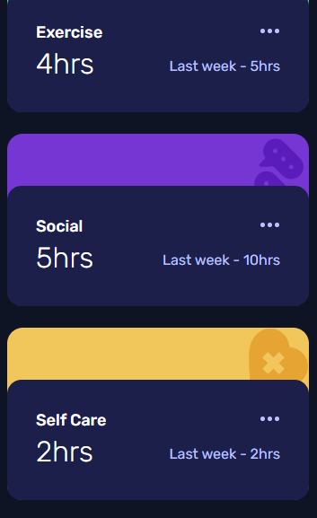

# Frontend Mentor - Time tracking dashboard solution

This is a solution to the [Time tracking dashboard challenge on Frontend Mentor](https://www.frontendmentor.io/challenges/time-tracking-dashboard-UIQ7167Jw).

## Table of contents

- [Overview](#overview)
  - [The challenge](#the-challenge)
  - [Screenshot](#screenshot)
  - [Links](#links)
- [My process](#my-process)
  - [Built with](#built-with)
- [Author](#author)

## Overview

### The challenge

Users should be able to:

- View the optimal layout for the site depending on their device's screen size
- See hover states for all interactive elements on the page
- Switch between viewing Daily, Weekly, and Monthly stats

### Screenshot

### Links

- Solution URL: [https://github.com/hoangnam-nguyen/time-tracking-dashboard-main](https://github.com/hoangnam-nguyen/time-tracking-dashboard-main)
- Live Site URL: [https://hoangnam-nguyen.github.io/time-tracking-dashboard-main/](https://hoangnam-nguyen.github.io/time-tracking-dashboard-main/)

## My process

### Built with

- Semantic HTML5 markup
- CSS custom properties
- Vanilla JavaScript
- Flexbox
- CSS Grid
- Mobile-first workflow

## Author

- GitHub - [Nguyen Hoang Nam](https://github.com/hoangnam-nguyen)
- Frontend Mentor - [@hoangnam-nguyen](https://www.frontendmentor.io/profile/hoangnam-nguyen)
- CodePen - [@hoangnam-nguyen](https://codepen.io/hoangnam-nguyen)
